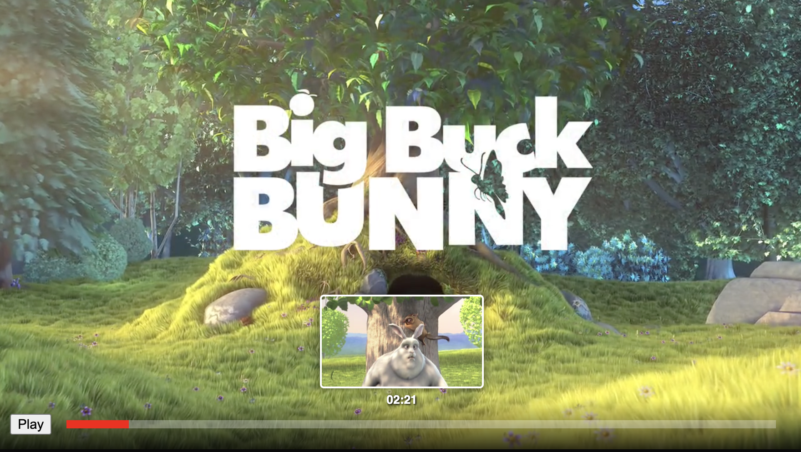

# youtube-video-preview

This project is a Proof of Concept (PoC) that simulates the Preview Thumbnail feature seen when hovering over a video progress bar, replicating the technique used by YouTube.

<div align="center">
  
</div>


# Concept & Technique

Instead of loading thousands of individual thumbnail images for every second of the video, we utilize the Image Sprites (Storyboard) technique:

**Backend** (FFmpeg): Extracts frames from the video and stitches them together into large image sheets (Sprite Sheets) arranged in a grid (e.g., 3x3, 5x5, 10x10).

<div align="center">
  
</div>

**Frontend** (Logic):

Calculates the specific timestamp when the user hovers over the progress bar (e.g., the 130th second).

Uses an algorithm to determine which specific Sprite Sheet contains that frame, and its exact grid index.

Applies CSS `background-position` and `background-size` to render only that specific tile.

The project supports 3 Levels of Detail (LoD) to demonstrate the trade-offs between quality and bandwidth:

- Level 1: 10x10 Grid (Small, low resolution, fast loading).
- Level 2: 5x5 Grid (Balanced).
- Level 3: 3x3 Grid (Large, high resolution).
# Setup

1. Requirements

Node.js (to run the server and generation scripts).

FFmpeg (to process video and cut images). Ensure FFmpeg is installed and the ffmpeg command is accessible in your terminal.

2. Setup

Install the necessary dependencies:
```
npm install
```

3. Prepare Video

Copy any video file (.mp4) into the root directory of the project and rename it to `input.mp4`


4. Generate Sprites

Run the script to have FFmpeg slice the video and generate the manifest.json configuration file:
```
npm run gen
```

(This process may take a few seconds to a minute depending on the video length)

5. Run Demo

Start the server:
```
npm start
```
Open your browser and visit: http://localhost:3000
